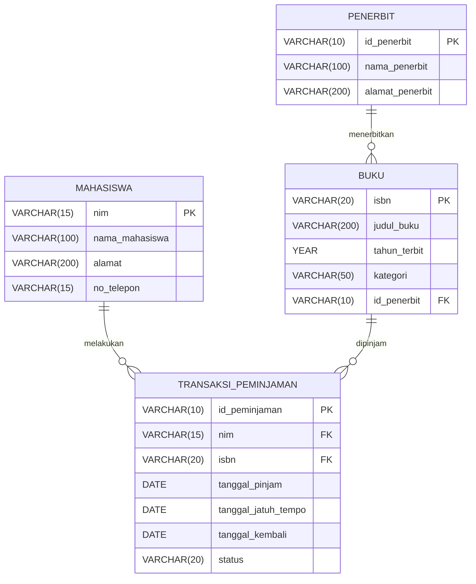

1. Desain ERD 

Sistem E-Library Kampus digunakan untuk mencatat data mahasiswa, buku, penerbit, serta transaksi peminjaman dan pengembalian buku.

Entitas yang Digunakan:

1. **Mahasiswa**
2. **Buku**
3. **Penerbit**
4. **Transaksi Peminjaman**

Relasi Antar Entitas

1. Satu **mahasiswa** dapat melakukan banyak transaksi peminjaman.
2. Satu **buku** dapat dipinjam berkali-kali melalui transaksi yang berbeda.
3. Satu **penerbit** dapat menerbitkan banyak buku.
4. Setiap **buku** diterbitkan oleh satu penerbit.
5. Setiap **transaksi peminjaman** dilakukan oleh satu mahasiswa untuk satu buku.

| Relasi | Kardinalitas | Keterangan |
|---|---|---|
| Mahasiswa - Transaksi Peminjaman | 1 : N | Satu mahasiswa dapat memiliki banyak transaksi |
| Buku - Transaksi Peminjaman | 1 : N | Satu buku dapat muncul dalam banyak transaksi |
| Penerbit - Buku | 1 : N | Satu penerbit dapat menerbitkan banyak buku |


2. Identifikasi Atribut

a. Entitas Mahasiswa

| Atribut | Keterangan | Key |
|---|---|---|
| nim | Nomor induk mahasiswa | PK |
| nama_mahasiswa | Nama lengkap mahasiswa | - |
| alamat | Alamat mahasiswa | - |
| no_telepon | Nomor telepon mahasiswa | - |

Primary Key: nim

b. Entitas Penerbit

| Atribut | Keterangan | Key |
|---|---|---|
| id_penerbit | Identitas unik penerbit | PK |
| nama_penerbit | Nama penerbit | - |
| alamat_penerbit | Alamat penerbit | - |

Primary Key: id_penerbit

c. Entitas Buku

| Atribut | Keterangan | Key |
|---|---|---|
| isbn | Nomor ISBN buku | PK |
| judul_buku | Judul buku | - |
| tahun_terbit | Tahun penerbitan buku | - |
| kategori | Kategori buku | - |
| id_penerbit | Identitas penerbit buku | FK |

Primary Key: isbn

Foreign Key: id_penerbit → penerbit.id_penerbit

d. Entitas Transaksi Peminjaman

| Atribut | Keterangan | Key |
|---|---|---|
| id_peminjaman | Identitas unik transaksi | PK |
| nim | Mahasiswa yang meminjam buku | FK |
| isbn | Buku yang dipinjam | FK |
| tanggal_pinjam | Tanggal buku dipinjam | - |
| tanggal_jatuh_tempo | Batas waktu pengembalian | - |
| tanggal_kembali | Tanggal buku dikembalikan | - |
| status | Status peminjaman | - |

Primary Key: id_peminjaman

Foreign Key:
- nim → mahasiswa.nim
- isbn → buku.isbn

3. Simulasi Normalisasi 

a. Unnormalized Form (UNF)

| NIM | Nama Mahasiswa | Alamat | Data Peminjaman |
|---|---|---|---|
| D121241001 | Rian | Makassar | {ISBN001, Basis Data, Penerbit Informatika, 2025, 01-10-2026, 08-10-2026}, {ISBN002, Pemrograman Web, Andi, 2024, 02-10-2026, 09-10-2026} |
| D121241002 | Akbar | Gowa | {ISBN001, Basis Data, Penerbit Informatika, 2025, 03-10-2026, 10-10-2026} |

Permasalahan UNF

- Terdapat kelompok data berulang dalam satu sel.
- Satu mahasiswa dapat memiliki beberapa data buku dalam satu baris.
- Data mahasiswa dapat ditulis berulang.
- Data penerbit dan buku juga dapat mengalami redundansi.
- Struktur belum memenuhi bentuk atomik.

b. First Normal Form (1NF)

Setiap atribut harus memiliki nilai yang atomik dan tidak boleh terdapat kelompok data berulang dalam satu sel. Setiap satu baris mewakili satu transaksi peminjaman.

Tabel 1NF

| NIM | Nama Mahasiswa | Alamat | ISBN | Judul Buku | Tahun Terbit | Nama Penerbit | Tanggal Pinjam | Tanggal Jatuh Tempo | Tanggal Kembali | Status |
|---|---|---|---|---|---|---|---|---|---|---|
| D121241001 | Rian | Makassar | ISBN001 | Basis Data | 2025 | Penerbit Informatika | 01-10-2026 | 08-10-2026 | 07-10-2026 | Dikembalikan |
| D121241001 | Rian | Makassar | ISBN002 | Pemrograman Web | 2024 | Andi | 02-10-2026 | 09-10-2026 | NULL | Dipinjam |
| D121241002 | Akbar | Gowa | ISBN001 | Basis Data | 2025 | Penerbit Informatika | 03-10-2026 | 10-10-2026 | NULL | Dipinjam |

c. Second Normal Form (2NF)

Untuk mencapai 2NF:

1. Tabel harus sudah memenuhi 1NF.
2. Tidak boleh terdapat ketergantungan parsial terhadap sebagian kunci.

Tabel Mahasiswa

| nim | nama_mahasiswa | alamat | no_telepon |
|---|---|---|---|
| D121241001 | Rian | Makassar | 081234567890 |
| D121241002 | Akbar | Gowa | 081298765432 |

**Primary Key:** nim

Tabel Buku

| isbn | judul_buku | tahun_terbit | kategori | id_penerbit |
|---|---|---:|---|---|
| ISBN001 | Basis Data | 2025 | Teknologi | P001 |
| ISBN002 | Pemrograman Web | 2024 | Teknologi | P002 |

**Primary Key:** isbn

**Foreign Key:** id_penerbit

Tabel Penerbit

| id_penerbit | nama_penerbit | alamat_penerbit |
|---|---|---|
| P001 | Penerbit Informatika | Bandung |
| P002 | Andi | Yogyakarta |

**Primary Key:** id_penerbit

Tabel Transaksi Peminjaman

| id_peminjaman | nim | isbn | tanggal_pinjam | tanggal_jatuh_tempo | tanggal_kembali | status |
|---|---|---|---|---|---|---|
| PJ001 | D121241001 | ISBN001 | 2026-10-01 | 2026-10-08 | 2026-10-07 | Dikembalikan |
| PJ002 | D121241001 | ISBN002 | 2026-10-02 | 2026-10-09 | NULL | Dipinjam |
| PJ003 | D121241002 | ISBN001 | 2026-10-03 | 2026-10-10 | NULL | Dipinjam |

**Primary Key:** id_peminjaman

**Foreign Key:**
- nim → mahasiswa.nim
- isbn → buku.isbn

d. Third Normal Form (3NF)

Untuk mencapai 3NF:

1. Tabel harus sudah memenuhi 2NF.
2. Tidak boleh terdapat ketergantungan transitif.
3. Atribut bukan kunci harus bergantung langsung pada Primary Key.

Skema Akhir 3NF

```text
mahasiswa
---------
nim (PK)
nama_mahasiswa
alamat
no_telepon


penerbit
--------
id_penerbit (PK)
nama_penerbit
alamat_penerbit


buku
----
isbn (PK)
judul_buku
tahun_terbit
kategori
id_penerbit (FK)


transaksi_peminjaman
--------------------
id_peminjaman (PK)
nim (FK)
isbn (FK)
tanggal_pinjam
tanggal_jatuh_tempo
tanggal_kembali
status
```

4. Tabel Akhir

a. Tabel mahasiswa
| Nama Kolom     | Tipe Data    | Constraint  | Keterangan            |
| -------------- | ------------ | ----------- | --------------------- |
| nim            | VARCHAR(15)  | PRIMARY KEY | Nomor induk mahasiswa |
| nama_mahasiswa | VARCHAR(100) | NOT NULL    | Nama mahasiswa        |
| alamat         | VARCHAR(200) | NOT NULL    | Alamat mahasiswa      |
| no_telepon     | VARCHAR(15)  | NOT NULL    | Nomor telepon         |

b. Tabel penerbit
| Nama Kolom      | Tipe Data    | Constraint  | Keterangan       |
| --------------- | ------------ | ----------- | ---------------- |
| id_penerbit     | VARCHAR(10)  | PRIMARY KEY | ID unik penerbit |
| nama_penerbit   | VARCHAR(100) | NOT NULL    | Nama penerbit    |
| alamat_penerbit | VARCHAR(200) | NOT NULL    | Alamat penerbit  |

c. Tabel buku
| Nama Kolom   | Tipe Data    | Constraint  | Keterangan        |
| ------------ | ------------ | ----------- | ----------------- |
| isbn         | VARCHAR(20)  | PRIMARY KEY | ISBN buku         |
| judul_buku   | VARCHAR(200) | NOT NULL    | Judul buku        |
| tahun_terbit | YEAR         | NOT NULL    | Tahun terbit buku |
| kategori     | VARCHAR(50)  | NOT NULL    | Kategori buku     |
| id_penerbit  | VARCHAR(10)  | FOREIGN KEY | ID penerbit       |

d. Tabel transaksi_peminjaman
| Nama Kolom          | Tipe Data   | Constraint            | Keterangan           |
| ------------------- | ----------- | --------------------- | -------------------- |
| id_peminjaman       | VARCHAR(10) | PRIMARY KEY           | ID unik transaksi    |
| nim                 | VARCHAR(15) | FOREIGN KEY, NOT NULL | NIM mahasiswa        |
| isbn                | VARCHAR(20) | FOREIGN KEY, NOT NULL | ISBN buku            |
| tanggal_pinjam      | DATE        | NOT NULL              | Tanggal peminjaman   |
| tanggal_jatuh_tempo | DATE        | NOT NULL              | Batas pengembalian   |
| tanggal_kembali     | DATE        | NULL                  | Tanggal pengembalian |
| status              | VARCHAR(20) | NOT NULL              | Status transaksi     |

5. Visualisasi


